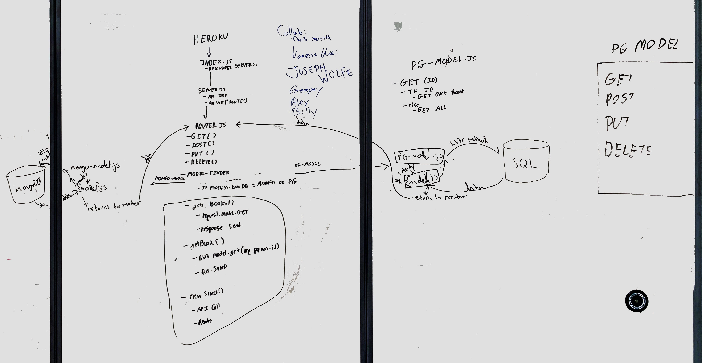
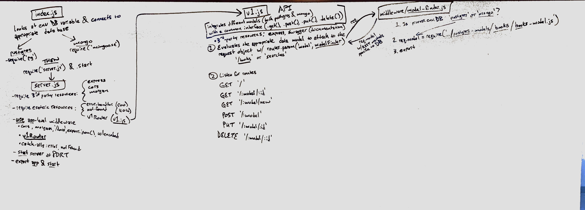

 PROJECT
=================================================

<!-- LINKS -->
<!-- Replace the link for each in brackets below -->
<!-- PR (working into submission) -->
[1]: https://github.com/401-advanced-javascript-billybunn/book-app/pull/1
<!-- travis build -->
[2]: https://travis-ci.com/401-advanced-javascript-billybunn/book-app/builds/106408585
<!-- back-end -->
[3]: http://xyz.com
<!-- front-end -->
[4]: https://billybunn-book-app-postgres.herokuapp.com/
<!-- swagger -->
[5]: http://xyz.com
<!-- jsdoc-->
[6]: https://billybunn-book-app-postgres.herokuapp.com/docs 

## Book App v2

### Author: Billy Bunn

### Links and Resources
* [PR][1]
* [travis][2]
<!-- (when applicable) -->
<!-- * [back-end][3] -->
<!-- (when applicable) -->
* [front-end][4]

#### Documentation
<!-- API assignments only -->
<!-- * [swagger][5] -->
<!-- (All assignments) -->
* [jsdoc][6]

### Modules
See jsDocs for exported values and methods.
#### `routes/`
* ##### `create-book.js`
* ##### `create-search.js`
* ##### `delete-book.js`
* ##### `get-book.js`
* ##### `get-books.js`
* ##### `new-search.js`
* ##### `update-book.js`
#### `middleware/`
* ##### `404.js`
* ##### `500.js`
* ##### `model-finder.js`
#### `models/`
<!-- * ##### `404.js`
* ##### `500.js`
* ##### `model-finder.js` -->

### Setup
#### `.env` requirements
* `npm i`
* `PORT` - assign a port number
* `DATABASE_URL` - URL to postgres database
* `MONGODB_URI` - URL to the running mongo database

#### Running the app
* `npm start`
* Endpoint: `/`
  * Renders a view of all books in the database
* Endpoint: `/books/:id`
  * Renders a view of a single book and it's detailed information
* Endpoint: `/searches/new`
  * Renders a search form to look up a book with the Google Books API

  
#### Tests
* How do you run tests?
  * `npm run test`
  * `npm run lint`
<!-- * What assertions were made?
* What assertions need to be / should be made? -->

#### UML
Initial planning whiteboard done in collaboration with classmates.

Detailed whiteboard by myself.

#### Collaborators
Many pieces of this project were acheived with the help of fellow Code Fellows 401 students. 
* Initial whiteboard planning was done in a large group with: 
Chris Merrit, Vanessa Wei, Joseph Wolfe, Gregory Dukes, and Alexander White.
* Further planning of datamodels was done with Joseph Wolfe,
* Modularization of existing postgres functionality was done with Chris Merritt, Erin Trainor, and Cory Henderson.